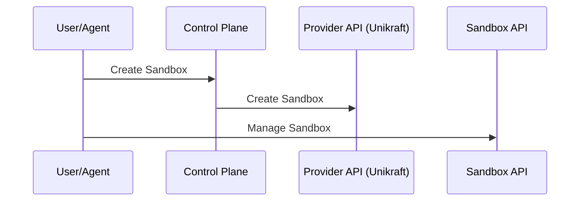
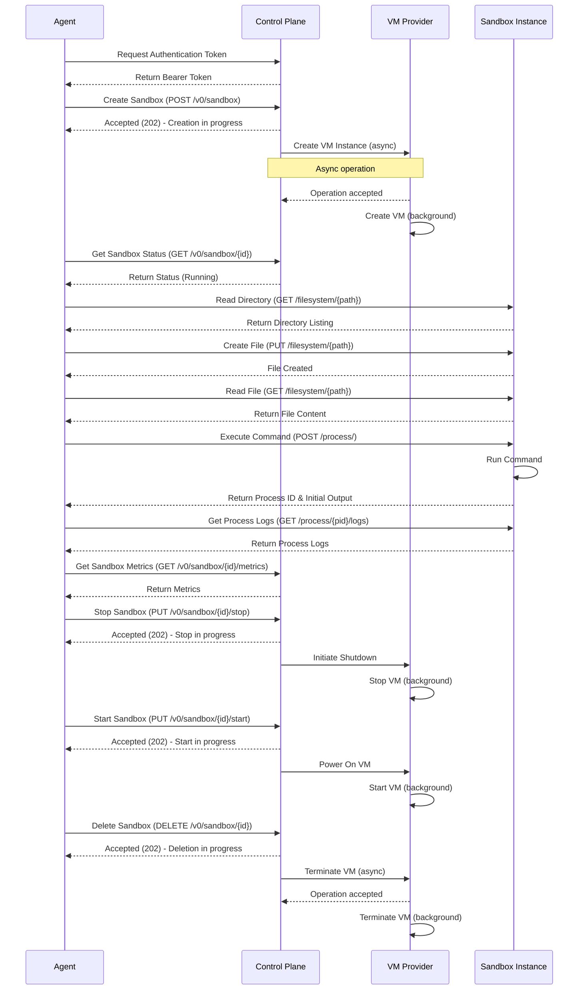

## Motivation

The idea is to provide sandboxed environments to AI Agents, so they can run command, manipulate FS and everything possible in operating system


## Potential users

- NestorAI
- Us

## Features

- Being able to manage the lifecycle of the sandboxed environment
    - Start
    - Stop
    - Resume
    - Delete
    - Clone
- Being able to manipulate the content of the sandbox in various way:
    - I/O
        - ReadFiles
        - ListFiles
        - CreateFile
        - UpdateFIle
        - DeleteFile
    - Command
        - Exec
- Exposed trough different interfaces:
    - HTTP API
    - MCP
    - SSH?

## API

### Lifecycle API - Control-plane

This API allows management of the sandbox lifecycle. Here are the expected responses for each endpoint:

#### List Sandboxes (GET `/v0/sandbox`)
```json
{
  "sandboxes": [
    {
      "metadata": {
        "name": "my-sandbox",
        "createdAt": "2023-10-10T15:30:00Z",
        "updatedAt": "2023-10-10T16:45:00Z",
        "createdBy": "user-123",
        "updatedBy": "user-123",
        "workspace": "default-workspace"
      },
      "spec": {
        "enabled": true,
        "image": "ubuntu:22.04",
        "resources": {
          "cpu": "1000m",
          "memory": "1Gi",
          "disk": "10Gi"
        },
        "env_vars": {
          "MY_VAR": "my_value"
        }
      },
      "status": "running",
      "events": [
        {
          "type": "CREATE",
          "status": "SUCCESS",
          "message": "Sandbox created successfully",
          "time": "2023-10-10T15:30:00Z",
          "revision": "rev-123"
        },
        {
          "type": "START",
          "status": "SUCCESS",
          "message": "Sandbox started successfully",
          "time": "2023-10-10T15:30:30Z",
          "revision": "rev-124"
        }
      ]
    },
    {
      "metadata": {
        "name": "test-sandbox",
        "createdAt": "2023-09-15T10:20:00Z",
        "updatedAt": "2023-09-15T14:30:00Z",
        "createdBy": "user-123",
        "updatedBy": "user-123",
        "workspace": "default-workspace"
      },
      "spec": {
        "enabled": false,
        "image": "alpine:3.16",
        "resources": {
          "cpu": "500m",
          "memory": "512Mi",
          "disk": "5Gi"
        }
      },
      "status": "stopped",
      "events": [
        {
          "type": "CREATE",
          "status": "SUCCESS",
          "message": "Sandbox created successfully",
          "time": "2023-09-15T10:20:00Z",
          "revision": "rev-456"
        },
        {
          "type": "STOP",
          "status": "SUCCESS",
          "message": "Sandbox stopped successfully",
          "time": "2023-09-15T14:30:00Z",
          "revision": "rev-457"
        }
      ]
    }
  ],
  "total": 2,
  "limit": 20,
  "offset": 0
}
```

#### Create Sandbox (POST `/v0/sandbox`)
```json
{
  "metadata": {
    "name": "my-sandbox",
    "createdAt": "2023-10-10T15:30:00Z",
    "updatedAt": "2023-10-10T15:30:00Z",
    "createdBy": "user-123",
    "updatedBy": "user-123",
    "workspace": "default-workspace"
  },
  "spec": {
    "enabled": true,
    "image": "ubuntu:22.04",
    "resources": {
      "cpu": "1000m",
      "memory": "1Gi",
      "disk": "10Gi"
    },
    "env_vars": {
      "MY_VAR": "my_value"
    }
  },
  "status": "creating",
  "events": [
    {
      "type": "CREATE",
      "status": "SUCCESS",
      "message": "Sandbox created successfully",
      "time": "2023-10-10T15:30:00Z",
      "revision": "rev-123"
    }
  ],
  "access": {
    "api_endpoint": "https://run.blaxel.ai/default-workspace/sandbox/my-sandbox",
    "mcp_endpoint": "https://mcp.blaxel.ai/default-workspace/function/my-sandbox"
  }
}
```

#### Get Sandbox (GET `/v0/sandbox/{sandboxId}`)
```json
{
  "metadata": {
    "name": "my-sandbox",
    "createdAt": "2023-10-10T15:30:00Z",
    "updatedAt": "2023-10-10T16:45:00Z",
    "createdBy": "user-123",
    "updatedBy": "user-123",
    "workspace": "default-workspace"
  },
  "spec": {
    "enabled": true,
    "image": "ubuntu:22.04",
    "resources": {
      "cpu": "1000m",
      "memory": "1Gi",
      "disk": "10Gi"
    },
    "env_vars": {
      "MY_VAR": "my_value"
    }
  },
  "status": "running",
  "events": [
    {
      "type": "CREATE",
      "status": "SUCCESS",
      "message": "Sandbox created successfully",
      "time": "2023-10-10T15:30:00Z",
      "revision": "rev-123"
    },
    {
      "type": "START",
      "status": "SUCCESS",
      "message": "Sandbox started successfully",
      "time": "2023-10-10T15:30:30Z",
      "revision": "rev-124"
    }
  ],
  "access": {
    "api_endpoint": "https://run.blaxel.ai/default-workspace/sandbox/my-sandbox",
    "mcp_endpoint": "https://mcp.blaxel.ai/default-workspace/function/my-sandbox"
  }
}
```

#### Get Sandbox Logs (GET `/v0/sandbox/{sandboxId}/logs`)
```json
{
  "logs": [
    {
      "timestamp": "2023-10-10T15:30:05Z",
      "level": "info",
      "message": "Sandbox created successfully"
    },
    {
      "timestamp": "2023-10-10T15:30:10Z",
      "level": "info",
      "message": "Starting sandbox..."
    },
    {
      "timestamp": "2023-10-10T15:30:15Z",
      "level": "info",
      "message": "Sandbox started"
    }
  ]
}
```

#### Get Sandbox Metrics (GET `/v0/sandbox/{sandboxId}/metrics`)
```json
{
  "period": "1h",
  "resolution": 60,
  "metrics": {
    "cpu": [
      {"timestamp": "2023-10-10T15:30:00Z", "value": 0.15},
      {"timestamp": "2023-10-10T15:31:00Z", "value": 0.25},
      {"timestamp": "2023-10-10T15:32:00Z", "value": 0.18}
    ],
    "memory": [
      {"timestamp": "2023-10-10T15:30:00Z", "value": 256000000},
      {"timestamp": "2023-10-10T15:31:00Z", "value": 260000000},
      {"timestamp": "2023-10-10T15:32:00Z", "value": 258000000}
    ],
    "disk": [
      {"timestamp": "2023-10-10T15:30:00Z", "value": 1500000000},
      {"timestamp": "2023-10-10T15:31:00Z", "value": 1500500000},
      {"timestamp": "2023-10-10T15:32:00Z", "value": 1501000000}
    ]
  }
}
```

#### Start Sandbox (PUT `/v0/sandbox/{sandboxId}/start`)
```json
{
  "metadata": {
    "name": "my-sandbox",
    "workspace": "default-workspace"
  },
  "status": "starting",
  "message": "Sandbox is starting"
}
```

#### Stop Sandbox (PUT `/v0/sandbox/{sandboxId}/stop`)
```json
{
  "metadata": {
    "name": "my-sandbox",
    "workspace": "default-workspace"
  },
  "status": "stopping",
  "message": "Sandbox is stopping"
}
```

#### Delete Sandbox (DELETE `/v0/sandbox/{sandboxId}`)
```json
{
  "metadata": {
    "name": "my-sandbox",
    "workspace": "default-workspace"
  },
  "status": "deleting",
  "message": "Sandbox is being deleted"
}
```

#### Clone Sandbox (POST `/v0/sandbox/{sandboxId}/clone`)
```json
{
  "metadata": {
    "name": "cloned-sandbox",
    "createdAt": "2023-10-11T09:15:00Z",
    "updatedAt": "2023-10-11T09:15:00Z",
    "createdBy": "user-123",
    "updatedBy": "user-123",
    "workspace": "default-workspace"
  },
  "spec": {
    "enabled": true,
    "image": "ubuntu:22.04",
    "resources": {
      "cpu": "2000m",
      "memory": "2Gi",
      "disk": "20Gi"
    }
  },
  "status": "creating",
  "events": [
    {
      "type": "CLONE",
      "status": "SUCCESS",
      "message": "Sandbox cloned successfully from sandbox-123",
      "time": "2023-10-11T09:15:00Z",
      "revision": "rev-789"
    }
  ],
  "access": {
    "api_endpoint": "https://run.blaxel.ai/default-workspace/sandbox/cloned-sandbox",
    "mcp_endpoint": "https://mcp.blaxel.ai/default-workspace/function/cloned-sandbox"
  }
}
```

### Sandbox API - internal to VM

This API is exposed within each sandbox environment and allows agents to interact with the sandbox. Here are the expected requests and responses for each endpoint:

#### Read File (GET `/filesystem/{path}` for a file)

**Response:**
```json
{
  "path": "/home/user/file.txt",
  "content": "file content as string",
  "permissions": "rwxr-xr-x",
  "size": 1024,
  "lastModified": "Mon, 10 Oct 2023 15:30:00 GMT",
  "owner": "user",
  "group": "group"
}
```

#### List Directory (GET `/filesystem/{path}` for a directory)

**Response:**
```json
{
  "path": "/home/user",
  "files": [
    {
      "path": "/home/user/file.txt",
      "permissions": "rwxr-xr-x",
      "size": 1024,
      "lastModified": "Mon, 10 Oct 2023 15:30:00 GMT",
      "owner": "user",
      "group": "group"
    }
  ],
  "subdirectories": [
    {
      "path": "/home/user/subdir"
    }
  ]
}
```

#### Get Filesystem Tree (GET `/filesystem/tree/{rootPath}`)

**Response:**
```json
{
  "path": "/home/user",
  "files": [...],
  "subdirectories": [...]
}
```

#### Create or Update Tree (PUT `/filesystem/tree/{rootPath}`)

**Request:**
```json
{
  "path": "/home/user",
  "files": {
    "file1.txt": "file content as string",
    "toto/file2.txt": "file content as string"
  }
}
```

**Response:**
```json
{
  "path": "/home/user",
  "files": [...],
  "subdirectories": [...],
  "message": "Tree created/updated successfully"
}
```

#### Create or Update File (PUT `/filesystem/{path}`)

**Request:**
```json
{
  "content": "file content as string",
  "isDirectory": false,
  "permissions": "644"
}
```

**Response:**
```json
{
  "path": "/home/user/file.txt",
  "message": "File created/updated successfully"
}
```

#### Create Directory (PUT `/filesystem/{path}`)

**Request:**
```json
{
  "isDirectory": true,
  "permissions": "755"
}
```

**Response:**
```json
{
  "path": "/home/user/directory",
  "message": "Directory created successfully"
}
```

#### Delete File or Directory (DELETE `/filesystem/{path}`)

**Request:**
```json
{
  "recursive": false
}
```

**Response:**
```json
{
  "path": "/home/user/file.txt",
  "message": "File deleted successfully"
}
```

#### List Processes (GET `/process/`)

**Response:**
```json
[
  {
    "pid": 1234,
    "command": "python3 script.py",
    "status": "running",
    "startedAt": "Mon, 10 Oct 2023 15:40:00 GMT",
    "completedAt": "Mon, 10 Oct 2023 15:45:00 GMT",
    "exitCode": 0,
    "workingDir": "/home/user"
  }
]
```

#### Execute Command (POST `/process/`)

**Request:**
```json
{
  "command": "python3 script.py",
  "workingDir": "/home/user",
  "waitForCompletion": false,
  "timeout": 30,
  "waitForPorts": [8000, 8080]
}
```

**Response:**
```json
{
  "pid": 1236,
  "command": "python3 script.py",
  "status": "running",
  "startedAt": "Mon, 10 Oct 2023 15:50:00 GMT",
  "workingDir": "/home/user",
  "exitCode": null
}
```

#### Get Process Logs (GET `/process/{pid}/logs`)

**Response:**
```json
{
  "pid": 1234,
  "stdout": "Hello from Python!",
  "stderr": "Warning: Deprecation notice"
}
```

#### Stop Process (DELETE `/process/{pid}`)

**Response:**
```json
{
  "pid": 1234,
  "message": "Process stopped successfully"
}
```

#### Kill Process (POST `/process/{pid}/kill`)

**Response:**
```json
{
  "pid": 1234,
  "message": "Process killed successfully"
}
```

#### Get Process Ports (GET `/network/process/{pid}/ports`)

**Response:**
```json
{
  "pid": 1234,
  "ports": [
    {
      "localPort": 8080,
      "protocol": "tcp"
    }
  ]
}
```

#### Monitor Process Ports (POST `/network/process/{pid}/monitor`)

**Request:**
```json
{
  "callback": "https://example.com/port-callback"
}
```

**Response:**
```json
{
  "pid": 1234,
  "message": "Port monitoring started"
}
```

#### Stop Monitoring Ports (DELETE `/network/process/{pid}/monitor`)

**Response:**
```json
{
  "pid": 1234,
  "message": "Port monitoring stopped"
}
```

#### Health Check (GET `/health`)

**Response:**
```json
{
  "status": "ok"
}
```

### Reco

-> dict k:v file

{
  "/home/user/file.txt": "file content as string",
  "/home/user/file2.txt": "file content as string"
}


## Components overview

Here's a high-level overview of the components that make up the OSaaS system:



## Agent Interaction Flow

The following sequence diagram illustrates the complete flow of an agent's interaction with the OS-as-a-Service system:




## CLI Usage

#### Sandbox Management

```bash
# List all sandboxes
bl sandbox list

# List sandboxes with filtering
bl sandbox list --status running --limit 10 --offset 0

# Get details of a specific sandbox
bl sandbox get my-sandbox

# Create a new sandbox
bl sandbox create \
  --name my-sandbox \
  --image ubuntu:22.04 \
  --cpu 1 \
  --memory 1Gi \
  --disk 10Gi \
  --env MY_VAR=my_value

# Start a sandbox
bl sandbox start my-sandbox

# Stop a sandbox
bl sandbox stop my-sandbox

# Delete a sandbox
bl sandbox delete my-sandbox

# Clone a sandbox
bl sandbox clone my-sandbox \
  --name cloned-sandbox \
  --cpu 2 \
  --memory 2Gi
```

#### Sandbox Monitoring

```bash
# Get sandbox logs
bl sandbox logs my-sandbox --tail 20

# Get sandbox metrics
bl sandbox metrics my-sandbox --period 1h --resolution 60
```

### Sandbox API Commands

When interacting with a specific sandbox, you can use the `bl run` command prefix which targets the Sandbox API of a specific sandbox instance.

#### File Operations

```bash
# Read a file
bl run my-sandbox file read /home/user/file.txt

# Get file content and decode from base64
bl run my-sandbox file read /home/user/file.txt --decode

# List directory contents
bl run my-sandbox file ls /home/user

# Get filesystem tree
bl run my-sandbox file tree /home/user --depth 3

# Create or update a file
bl run my-sandbox file write /home/user/file.txt --content "Hello World"
# Or from a local file
bl run my-sandbox file write /home/user/file.txt --from-file ./local-file.txt

# Delete a file or directory
bl run my-sandbox file rm /home/user/file.txt
# Delete a directory recursively
bl run my-sandbox file rm /home/user/directory --recursive
```

#### Process Management

```bash
# List all processes
bl run my-sandbox process list

# Execute a command
bl run my-sandbox process exec "python3 script.py"
# With working directory
bl run my-sandbox process exec "python3 script.py" --working-dir /home/user

# Get process logs
bl run my-sandbox process logs 1234

# Terminate a process
bl run my-sandbox process kill 1234
```

### Examples of Common Workflows

#### Setting up a Python Environment

```bash
# Create a new sandbox
bl sandbox create --name python-env --image python:3.9

# Wait for the sandbox to be running
bl sandbox wait python-env --status running

# Create a requirements.txt file
bl run python-env file write /app/requirements.txt --content "
numpy==1.21.0
pandas==1.3.0
matplotlib==3.4.2
"

# Create a Python script
bl run python-env file write /app/script.py --content "
import numpy as np
import pandas as pd
import matplotlib.pyplot as plt
print('Python environment is ready!')
"

# Install dependencies
bl run python-env process exec "pip install -r /app/requirements.txt"

# Run the script
bl run python-env process exec "python /app/script.py"
```

#### Data Processing Pipeline

```bash
# Create a sandbox for data processing
bl sandbox create --name data-processor --image ubuntu:22.04 --cpu 2 --memory 4Gi

# Install required software
bl run data-processor process exec "apt-get update && apt-get install -y python3 python3-pip"

# Upload data files
bl run data-processor file write /data/input.csv --from-file ./local-data.csv

# Create and run processing script
bl run data-processor file write /data/process.py --from-file ./process.py
bl run data-processor process exec "python3 /data/process.py"

# Download results
bl run data-processor file read /data/output.csv > ./processed-data.csv
```
